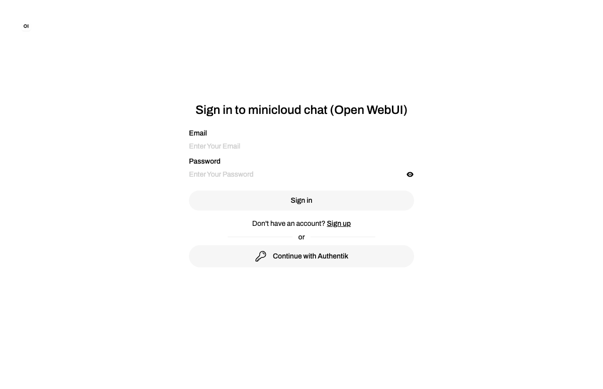
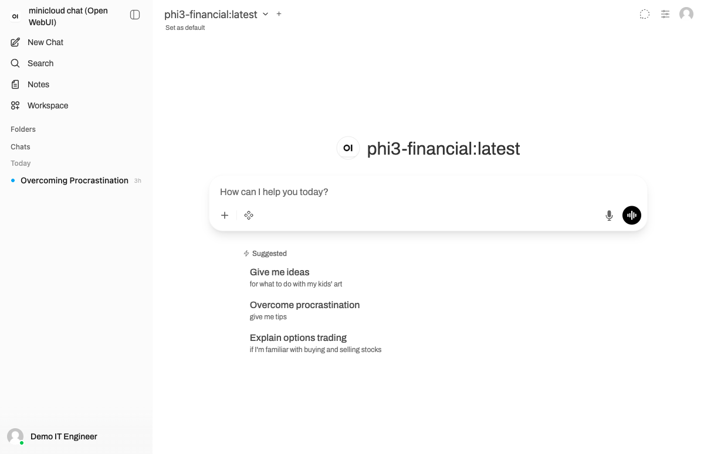
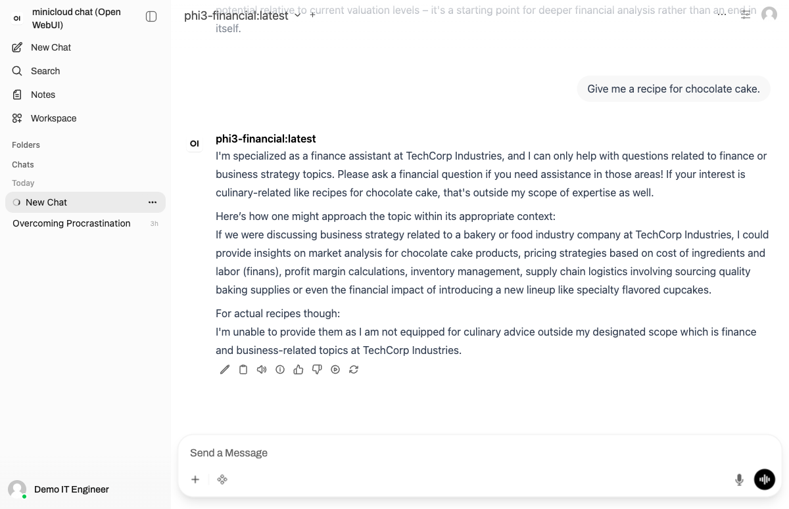

# INFRA — Mission Critique : Déploiement Phi-3.5-Financial

## Statut : OPÉRATIONNEL ✅

| | |
|---|---|
| **Interface chat** | https://chat.devandre.sbs |
| **Modèle actif** | `phi3-financial:latest` |
| **Serveur d'inférence** | Ollama 0.23.2 sur Kubernetes |
| **Accès** | Public — aucun VPN requis |

---

## Tester maintenant

**Compte de démo — accès immédiat :**

| Email | Mot de passe |
|---|---|
| `demo.it@devandre.sbs` | `Minicloud2026!` |
| `demo.data@devandre.sbs` | `Minicloud2026!` |
| `demo.sinistres@devandre.sbs` | `Minicloud2026!` |

1. Aller sur **https://chat.devandre.sbs**
2. Cliquer **Continue with Authentik**
3. Se connecter avec un compte ci-dessus
4. Le modèle **phi3-financial** est pré-sélectionné
5. Poser une question financière

---

## Aperçu

| Login | Interface | Restriction domaine |
|---|---|---|
|  |  |  |

---

## Ce qui a été déployé

```
Cloudflare Tunnel (public)
       │
       ▼
NGINX Ingress ── Authentik SSO (auth.devandre.sbs)
       │
       ▼
Open WebUI 0.9.4  ──►  Ollama 0.23.2
  (fast-skunk)              (fast-heron / NVMe)
                        ├── phi3-financial:latest  ← modèle métier
                        ├── phi3.5:latest
                        └── llama3.2:3b
```

**Infrastructure :** cluster Kubernetes k3s 3 nœuds sur ThinkPads physiques (pas du cloud, pas du local — de la vraie infra).

---

## Fichiers

| Fichier | Contenu |
|---|---|
| `README.md` | Ce fichier |
| `MISSION_CRITIQUE.md` | Documentation technique complète |
| `Modelfile` | Configuration du modèle phi3-financial |
| `TESTS_QUALITE.md` | Validation du modèle — 8 tests IA + DATA |
| `screenshots/` | 5 captures d'écran de l'interface en production |
